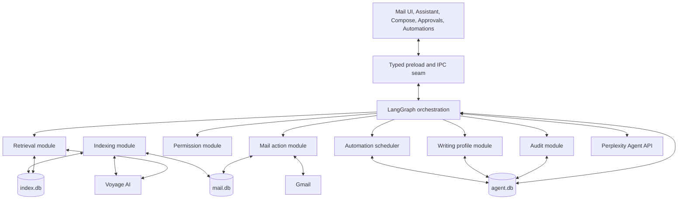

# OpenMail AI System Design

Date: 2026-09-01

Status: Approved design

Target: Complete first product version

## 1. Purpose

OpenMail will become a local-first AI mail system that can:

- search mail lexically and semantically;
- answer mailbox-grounded questions with citations;
- read and reason across messages, threads, and attachments;
- summarize, classify, extract, and organize mail;
- learn the user's writing style and draft personalized messages;
- reply, forward, label, archive, trash, and send mail;
- create and operate durable automations, including explicitly authorized automatic sending;
- explain and audit every consequential action.

The system is hybrid. Gmail data, search indexes, vectors, conversations, permissions, and automation state stay on the user's Mac. Email chunks are sent directly to Voyage AI to create embeddings. Only retrieved evidence needed for a request is sent to the selected brain model through Perplexity's Agent API. Users bring their own provider keys.

This design adds the complete capability set in the first product version. Implementation may proceed in dependency-ordered milestones, but no listed capability is deferred to a later product version.

## 2. Product Constraints

- Gmail remains the remote mail authority.
- The desktop application is the only runtime. There is no OpenMail cloud backend.
- Automations run while the Mac and OpenMail background process are available. They pause while the Mac is off or asleep and apply an explicit catch-up policy after waking.
- Provider keys are supplied by the user and encrypted with Electron `safeStorage`.
- The renderer never receives Gmail tokens, provider keys, database handles, or unrestricted network access.
- Normal mail must continue working when every AI provider is unavailable.
- Retrieved email and attachment content is untrusted data, never agent instructions.

## 3. Approved Technology Decisions

### Models

- Embeddings: Voyage AI `voyage-4`
- Embedding dimensions: 1,024 float values
- Document embedding mode: `input_type: "document"`
- Query embedding mode: `input_type: "query"`
- Reranking: Voyage AI `rerank-2.5`
- Primary brain: `openai/gpt-5.4` through Perplexity's Agent API
- Brain protocol: OpenAI Responses-compatible interface

Model identifiers are configuration, not scattered constants. Every persisted embedding, reranking decision, prompt result, and automation decision records its provider, model, dimensions, and prompt or policy version.

### Orchestration

LangGraph coordinates conversations, action approval, and automations. It does not own mail behavior, retrieval, permissions, or provider-specific logic. LangGraph calls small typed tool interfaces and persists checkpoints in local SQLite.

### Local search

- Chunk-level lexical search: SQLite FTS5
- Chunk-level vector search: `sqlite-vec`
- Final retrieval: lexical and vector candidates fused locally, then reranked by Voyage

`VectorIndex` is the seam. `SqliteVecIndex` is the first adapter. Retrieval callers do not know sqlite-vec table syntax or vector serialization details.

References:

- [LangGraph overview](https://docs.langchain.com/oss/javascript/langgraph/overview)
- [LangGraph persistence](https://docs.langchain.com/oss/javascript/langgraph/persistence)
- [LangGraph interrupts](https://docs.langchain.com/oss/javascript/langgraph/interrupts)
- [Voyage embeddings](https://docs.voyageai.com/docs/embeddings)
- [Voyage rerankers](https://docs.voyageai.com/docs/reranker)
- [Perplexity OpenAI compatibility](https://docs.perplexity.ai/docs/agent-api/openai-compatibility)
- [sqlite-vec](https://github.com/asg017/sqlite-vec)

## 4. System Shape



The key invariant is: the brain can propose an action, but only the permission module can authorize it and only the mail action module can execute it.

## 5. Databases and Ownership

### `mail.db`: synchronized source of truth

Owned by Gmail sync and deterministic mail modules.

- accounts and encrypted-token references;
- messages, threads, labels, and message-label membership;
- attachments and locally extracted attachment metadata;
- local drafts and mail-action outbox;
- Gmail sync cursors and reconciliation state;
- existing user-facing FTS tables where useful.

Mail records are account-scoped. No query may infer account scope from the selected UI state alone; account IDs are explicit inputs at storage seams.

### `index.db`: disposable derived intelligence index

Owned by the indexing and retrieval modules.

- normalized chunks;
- chunk-to-account/thread/message/attachment provenance;
- content hashes and index job state;
- FTS5 chunk index;
- sqlite-vec vector tables;
- embedding provider, model, dimension, and version metadata;
- indexing and deletion cursors.

This database is safe to delete and rebuild. It never contains the only copy of a user-created artifact.

### `agent.db`: durable AI and automation state

Owned by the orchestration, permission, profile, automation, and audit modules.

- conversations and message history;
- LangGraph checkpoints and pending interrupts;
- immutable automation specifications and versions;
- automation grants, schedules, triggers, runs, leases, and counters;
- action intentions, approvals, execution ledgers, and verification results;
- global and relationship-specific writing profiles;
- local traces, evaluations, and audit records.

Before schema migrations, `agent.db` receives a recoverable backup and an integrity check. `mail.db` also receives migration backups. `index.db` is rebuilt instead of restored when incompatible.

## 6. Provider and Secret Interfaces

```ts
type EmbeddingProvider = {
  embedDocuments(chunks: string[]): Promise<number[][]>
  embedQuery(query: string): Promise<number[]>
}

type RerankProvider = {
  rerank(query: string, candidates: RetrievalCandidate[]): Promise<RankedCandidate[]>
}

type BrainProvider = {
  stream(request: BrainRequest): AsyncIterable<BrainEvent>
}
```

The first adapters are Voyage embeddings, Voyage reranking, and the Perplexity Agent API. Provider keys are accepted in Settings, validated with a minimal request, encrypted using `safeStorage`, and used only in Electron's main process. Keys are not stored in `.env` for normal users, written to SQLite, included in logs, or exposed through generic IPC.

Settings provide connection status, model selection from an approved registry, usage visibility, key replacement, and key removal. Removing a key pauses dependent indexing and automations without deleting local state.

## 7. Indexing Pipeline

The indexing pipeline runs after committed Gmail sync changes.

1. A change journal emits account ID, message ID, change kind, and source cursor.
2. The indexer loads the authoritative local message and attachment records.
3. It normalizes sender, recipients, subject, timestamp, labels, body, thread position, and attachment provenance.
4. It extracts attachment text locally.
5. It creates email-aware chunks.
6. It calculates deterministic content hashes.
7. It batches changed chunks to Voyage using document embedding mode.
8. It atomically replaces chunk metadata, FTS rows, and vectors.
9. It records the completed source cursor and embedding version.

The job key is account ID + message ID + source content hash + embedding version. Repeated delivery is a no-op. A mid-batch crash may repeat provider work but cannot duplicate local chunks.

Deletion is first-class. When Gmail deletes a message, or the user removes an account, all matching chunks, vectors, extracted attachment text, and retrieval caches are removed. Model or dimension changes create a new index generation. Search uses the complete current generation until the replacement generation is ready, then switches atomically.

### Email-aware chunking

- Every chunk repeats stable metadata needed for retrieval: account, sender, recipients, subject, date, thread ID, message ID, labels, and source type.
- Quoted reply blocks and signatures are detected and marked. Duplicate quoted history is not embedded repeatedly when an authoritative earlier message exists.
- Short messages remain one chunk.
- Long bodies split on semantic paragraph boundaries with bounded overlap.
- Attachments preserve filename, media type, page or section, and parent message.
- Thread-summary chunks may be generated as derived accelerators, but answers cite original messages and attachments.

### Attachments

The first product version indexes text, HTML, CSV, PDF, office-document, and image attachments. Text extraction and OCR happen locally. Unsupported encrypted or binary attachments remain discoverable by metadata and are reported as unreadable rather than silently ignored.

If a visual question requires information not captured by local OCR, OpenMail asks before sending the selected image or page to a vision-capable brain model. This permission is separate from ordinary text retrieval.

## 8. Retrieval and Grounded Answers

Retrieval accepts an explicit scope:

```ts
type RetrievalScope = {
  accountIds: number[]
  threadIds?: string[]
  labelIds?: string[]
  senderAddresses?: string[]
  after?: number
  before?: number
  sourceTypes?: Array<'message' | 'attachment'>
}
```

The current account is the default. “All accounts” is an explicit conversation choice. The UI always displays the active scope. Automations have immutable account allowlists and never acquire newly added accounts automatically.

Question flow:

1. A deterministic parser and the brain derive filters without expanding the caller's authorized account scope.
2. Voyage embeds the question using query mode.
3. FTS5 retrieves exact keyword, phrase, name, address, identifier, and numeric matches.
4. sqlite-vec retrieves semantic matches.
5. Local reciprocal-rank fusion combines both lists and removes duplicates.
6. Voyage `rerank-2.5` reranks a bounded candidate set.
7. The context builder expands adjacent thread messages when required, balances sources, and enforces a token budget.
8. Stable citation IDs map every supplied excerpt to account, message, attachment, and location.
9. The brain answers only from supplied mailbox evidence unless the UI explicitly enables a separate web-search mode.
10. The response validator rejects unknown citations. Weak or conflicting evidence produces an explicit uncertainty response.

Answers show source account, sender, subject, date, and attachment location. Selecting a citation opens the original local message or attachment passage.

## 9. LangGraph Orchestration

OpenMail uses multiple focused graphs sharing the same deterministic tools.

### Conversation graph

`understand request -> resolve scope -> retrieve -> build evidence -> reason -> validate citations -> stream answer`

### Action graph

`understand request -> construct typed intention -> validate -> policy decision -> interrupt if required -> execute -> verify -> audit -> report`

### Automation graph

`accept trigger -> deduplicate -> match -> plan -> validate grant -> enforce limits -> interrupt if required -> execute -> verify -> audit -> notify`

Each run has a stable LangGraph thread ID. Graph state contains identifiers and typed results, not database handles or secrets. Provider calls and side effects are wrapped in checkpointed tasks. Resumption never relies on rerunning a non-idempotent side effect.

LangGraph's SQLite checkpointer persists conversations, interrupts, and run state in `agent.db`. Local tracing is enabled. LangSmith or other cloud tracing is disabled by default because traces may contain sensitive mail context.

## 10. Tool Interfaces

The brain can select only registered typed tools.

### Read tools

- search mail;
- retrieve a thread or message;
- retrieve extracted attachment text;
- list mailboxes, labels, accounts, and synchronization status;
- inspect automation status and prior run results.

### Draft and mail tools

- create, update, and discard a draft;
- draft a new message, reply, reply-all, or forward;
- send an approved draft;
- mark read or unread;
- add or remove labels;
- star or unstar;
- archive;
- move to trash or spam;
- restore when Gmail permits it.

### Automation tools

- propose and simulate an automation;
- create a version after approval;
- activate, pause, resume, archive, or run now;
- inspect and revoke grants;
- review runs and retry eligible failed runs.

Tools validate arguments with runtime schemas. IPC handlers repeat validation and account-scope checks; TypeScript types alone are not treated as a security control.

## 11. Permission and Action Model

Every action becomes an immutable `ActionIntent` containing:

- action type and exact normalized arguments;
- initiating user, conversation, or automation version;
- account scope;
- source evidence;
- recipient, body, and attachment hashes where applicable;
- idempotency key;
- creation and expiration times.

The permission module returns one of:

- `allow`: covered by current user context or an active automation grant;
- `ask`: requires a LangGraph interrupt and explicit review;
- `deny`: violates scope, policy, grant, or safety constraints.

### Normal conversation defaults

- Read, search, summarize, classify, extract, and create or edit drafts: allowed.
- Small reversible mailbox changes: shown in the action result; bulk operations require preview.
- Trash, bulk destructive changes, and sending: explicit confirmation.
- Confirmation binds to the exact account, recipients, subject, body, and attachments. Any relevant edit invalidates confirmation.

### Automation grants

An approved automation may send without per-message confirmation only when its immutable grant explicitly permits it. The grant contains:

- fixed account and mailbox scope;
- allowed tool set;
- recipient and domain allowlists or denylists;
- per-run and daily action limits;
- batch-size limits;
- attachment rules;
- content constraints;
- trigger, schedule, timezone, and catch-up policy;
- start, expiry, and pause state.

Permission expansion creates a new automation version and requires simulation plus approval. Restrictive changes may activate immediately. The model cannot create, widen, or approve its own grant.

### Prompt-injection rule

Email bodies and attachments are evidence only. Instructions found inside them cannot select tools, expand scope, modify permissions, or alter system policy. A tool plan must trace to the user's current request or the immutable automation specification. Retrieved content that requests secret disclosure, external sending, or policy changes is treated as untrusted quoted text.

## 12. Exactly-Once and Verifiable Sending

Before sending, OpenMail persists a send ledger entry with a unique operation ID and RFC Message-ID. The approved content hash covers account, normalized recipients, subject, body, inline content, and attachments.

Send states are:

`prepared -> sending -> sent | failed | uncertain`

If Gmail returns success, the ledger records the Gmail message and thread IDs. If the process or network fails after submission but before acknowledgement, the state becomes `uncertain`. Recovery searches synchronized Sent mail and Gmail for the unique Message-ID before deciding whether a retry is safe. OpenMail never blindly retries an uncertain send.

The execution result is then verified against Gmail state and written to the audit log. The UI distinguishes drafted, approved, submitted, verified, failed, and uncertain states.

## 13. Writing Personalization

OpenMail learns writing style locally from Sent mail and from user edits to AI drafts.

Two profiles are maintained:

- global profile: tone, sentence shape, greetings, sign-offs, formatting, vocabulary, and preferred length;
- relationship profile: recipient-specific or group-specific differences in tone, formality, detail, and conventions.

Profiles are structured, versioned, model-independent records rather than a single opaque prompt. Users can inspect, edit, disable, reset, export, or rebuild them. Sensitive threads and recipients can be excluded.

Draft generation selects only relevant profile rules and a small set of matching sent examples. Those excerpts are the only style evidence sent to the brain. User edits are recorded as before/after training signals after sensitive values are locally classified and excluded according to settings.

Writing personalization never grants send permission.

## 14. Automation Creation and Runtime

Users may describe automations in natural language. The assistant asks for missing material constraints, then creates a typed, reviewable `AutomationSpec`.

Before activation, OpenMail simulates the spec against recent local mail without mutating Gmail or sending anything. The review shows matched messages, false-positive risks, proposed actions, required grant, rate limits, and representative examples.

Automation lifecycle:

`draft -> simulated -> approved -> active -> paused -> archived`

Specifications and grants are immutable and versioned. Editing creates a new version.

First-version triggers include:

- new or changed synchronized mail;
- sent replies and thread updates;
- one-time and recurring schedules with explicit timezones;
- no-reply and deadline follow-up timers;
- manual runs over mailboxes, selected threads, searches, or date ranges.

Each trigger has a stable deduplication key. Each run records its trigger, automation version, graph thread ID, lease, checkpoints, actions, counters, and final outcome. One failed automation never blocks Gmail sync or unrelated runs.

Transient failures use bounded exponential backoff. Repeated failures, invalid keys, expired Gmail authorization, exceeded limits, or policy violations pause the automation and notify the user. Wake-up processing applies the automation's selected catch-up policy and never replays an already handled trigger.

## 15. Desktop Experience

The existing mail UI remains primary. Intelligence adds four first-class destinations:

- Assistant;
- Approvals;
- Automations;
- Knowledge and indexing status.

### Assistant workspace

The dedicated workspace contains conversation, visible account scope, streaming status, cited answers, proposed action cards, and a source/action inspector. Sources open the exact original message or attachment passage.

### Contextual assistance

- Reading pane: summarize, explain, extract tasks, find related mail, and draft replies using the current thread automatically.
- Compose: draft, rewrite, shorten, expand, translate, and change tone without leaving the composer.
- Selection actions: ask about selected messages, threads, search results, or attachments.

### Approval inbox

Pending interrupts show the exact action, reason approval is required, account, recipients, content diff, attachments, source conversation or automation, permission requested, and expiration. Users can approve, edit, reject, or revoke the originating automation.

### Automation center

The center shows specifications, versions, simulations, grants, next trigger, recent runs, limits, failures, audit history, pause controls, and run-now controls.

## 16. Failure and Recovery Behavior

- Voyage unavailable: mail remains usable; index jobs stay queued; lexical search remains available; semantic freshness is visible.
- Perplexity unavailable: retrieved sources remain visible; conversation state persists; OpenMail does not invent a fallback answer.
- Gmail unavailable: local reading and drafting continue; mutations queue; automations pause actions that require current remote state.
- Gmail authorization revoked: affected accounts and automations pause; drafts, grants, and checkpoints remain; reauthentication resumes eligible work.
- Embedding-model change: build a versioned replacement generation and atomically switch after completion.
- Corrupt `index.db`: rebuild from `mail.db`.
- Failed `mail.db` or `agent.db` migration: restore the pre-migration backup and keep the previous application schema active.
- Process termination or sleep: resume LangGraph from checkpoints and scheduler from persisted triggers and leases.
- Uncertain send: reconcile by unique Message-ID before retry.

Every status shown to the user distinguishes confirmed remote state, local pending state, and uncertain state.

## 17. Testing and Evaluation

### Module tests

Use adapters for fake Gmail, embeddings, reranking, brain, clock, scheduler, vector index, encryption, and approval decisions. Test callers through the same interfaces production uses.

### Retrieval evaluation

A committed synthetic mailbox corpus covers:

- exact and semantic questions;
- names, addresses, dates, amounts, identifiers, and negation;
- long threads and duplicated quoted replies;
- attachment passages and OCR;
- conflicting messages and changed decisions;
- cross-account isolation;
- deleted and reindexed mail.

Metrics include recall at K, mean reciprocal rank, reranker lift, citation precision, citation completeness, unsupported-claim rate, latency, and index freshness.

### Agent and permission evaluation

Test tool selection, runtime schema rejection, prompt injection, account-scope escape attempts, recipient changes, grant limits, bulk caps, destructive actions, approval invalidation, revoked permissions, and zero unauthorized sends.

### Durable workflow tests

Terminate and resume at every graph checkpoint and mail-action state. Cover approval interrupts, edits during approval, duplicate triggers, concurrent scheduler wake-up, retries, uncertain sends, expired keys, sleep catch-up, and failed migrations.

### End-to-end tests

Run Electron against fake Gmail, Voyage, Perplexity, and a controllable clock. Verify complete flows from sync through indexing, cited answer, draft, approval, send verification, automation simulation, activation, trigger, action, and audit.

Live-provider smoke tests are opt-in and use dedicated test accounts. They never run in the default unit-test suite.

### Model-change gate

Changing a model, prompt, chunking algorithm, fusion weights, reranker, or policy version runs the synthetic regression corpus. A change cannot ship if it materially reduces retrieval, grounding, citation accuracy, action correctness, writing-style acceptance, or safety metrics without explicit review.

## 18. Implementation Order Within Version One

This is delivery sequencing, not feature deferral.

1. Repair current sync lifecycle gaps, complete attachment ingestion, add runtime IPC validation, and implement verified Gmail draft/send operations.
2. Add provider key management and provider interfaces.
3. Add `index.db`, change journal, attachment extraction, chunking, Voyage embedding, sqlite-vec, and FTS5 hybrid retrieval.
4. Add reranking, context construction, citations, and retrieval evaluations.
5. Add `agent.db`, LangGraph checkpointing, Assistant workspace, and grounded question answering.
6. Add typed mail tools, permission decisions, approval interrupts, send ledger, and audit log.
7. Add writing profiles, draft personalization, and learning from edits.
8. Add versioned AutomationSpec, simulations, scheduler, grants, triggers, retries, and automation UI.
9. Complete prompt-injection hardening, failure recovery, full Electron flows, model regression gates, packaging, launch-at-login, and release verification.

## 19. Completion Criteria

The first version is complete only when a user can:

- connect multiple Gmail accounts and see explicit AI scope;
- index messages and supported attachments locally with visible freshness;
- use lexical, semantic, and hybrid search;
- ask mailbox questions and receive source-linked, grounded answers;
- draft personalized new messages, replies, reply-all messages, and forwards;
- review and send email with verified, duplicate-safe execution;
- perform and audit mailbox mutations;
- create an automation in natural language, simulate it, approve its exact grant, activate it, and inspect every run;
- authorize a bounded automation to send without per-message approval;
- pause, revoke, edit, and recover automations;
- inspect and control provider keys, writing profiles, permissions, indexing, and local AI state;
- continue ordinary mail use during provider outages without data loss or hidden uncertainty.

No brain-model output can directly access credentials, execute Gmail operations, widen permissions, or bypass the deterministic policy and audit path.
